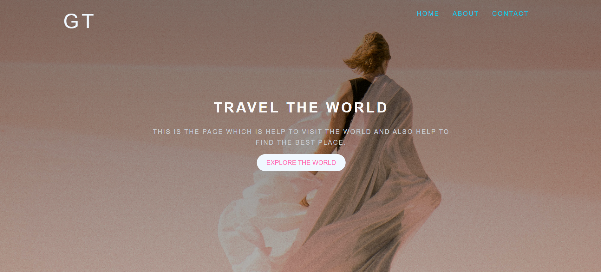
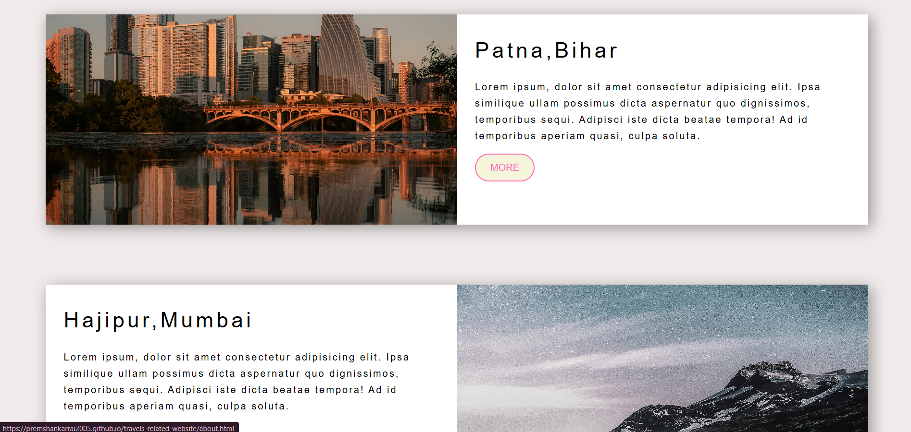
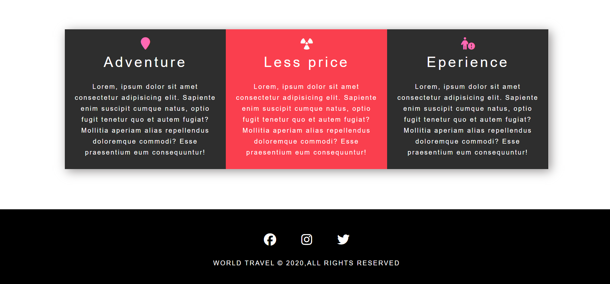

# 🌍 Travel Website (Dummy Project)

This is a **dummy travel website** created for practice and learning purposes.  
It showcases basic travel-related content like destinations, blogs, and services.

## ✈️ Features
- Home page with travel theme
- Popular destinations section
- Simple blog/articles section
- Responsive design (works on mobile & desktop)

## 🛠 Tech Used
- HTML
- CSS
- JavaScript  

## 🚀 How to Use
1. Clone or download this repository.
2. Open `index.html` in your browser.
3. Explore the demo pages.

## 📌 Note
This is **not a real travel booking website**. It’s only for educational/demo purposes.

## 📂 Project overview 

